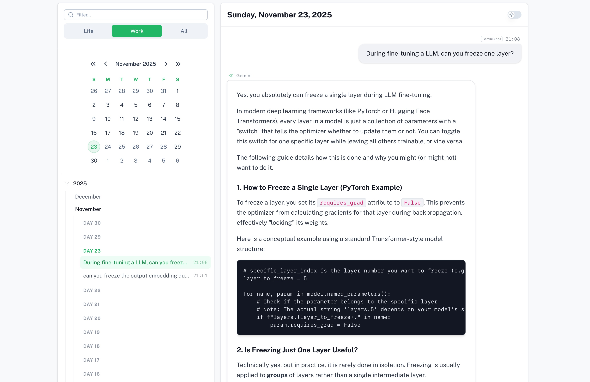
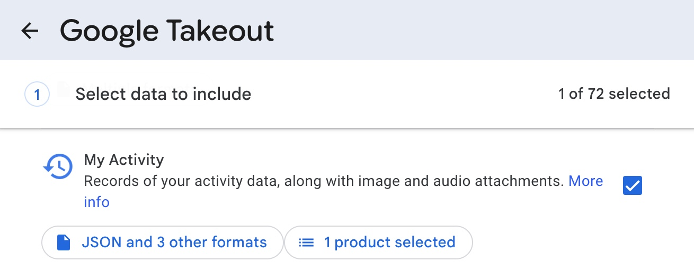

# Gemini Log Viewer

A beautiful and privacy-focused viewer for your Google Gemini interaction logs.



## Demo

**[Live Demo](https://sanxing-chen.github.io/gemini-log-viewer/)**

The demo allows you to upload your `MyActivity.json` file directly in the browser to view your Gemini conversation history. 

**Privacy Note:** This viewer runs entirely in your browser. Your log data is **never** uploaded to any server. It is parsed and rendered locally on your device.

## How to Get Your Gemini Logs

To use this viewer, you need to export your Gemini data from Google Takeout:

1. Go to [Google Takeout](https://takeout.google.com/).
2. In the "Select data to include" section, click "Deselect all".
3. Scroll down and find **Gemini** under **My Activity**, check the box next to it.
4. Change the format for **Activity records** to **JSON**.
5. Click "Next step" at the bottom.
6. Choose your "File type, frequency & destination" (usually the default `.zip` and "Send download link via email" is fine).
7. Click "Create export".
8. Once the export is ready (it might take a few moments), download and unzip the file.
9. Locate the `Gemini/MyActivity.json` file inside the extracted folder.
10. Upload this file to the demo website or the local application.

**Note:** You can also view logs from **xAI's Grok**. Go to **Settings -> Data Controls -> Export Account data**, download the data, and upload the `prod-grok-backend.json` file here.



## Development

This project is built with [Nuxt](https://nuxt.com) and [Nuxt UI](https://ui.nuxt.com).

### Prerequisites

- Node.js
- npm

### Setup

```bash
# Install dependencies
npm install

# Start the development server
npm run dev
```
